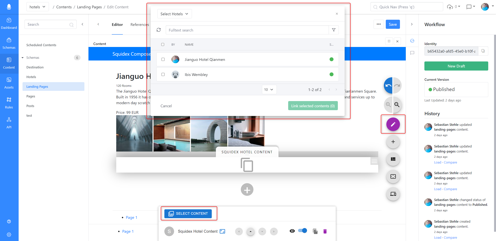
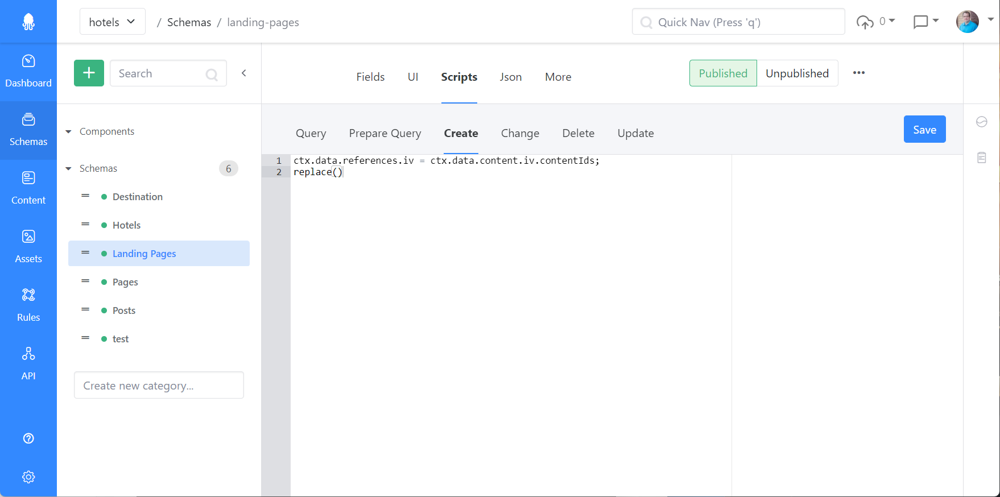
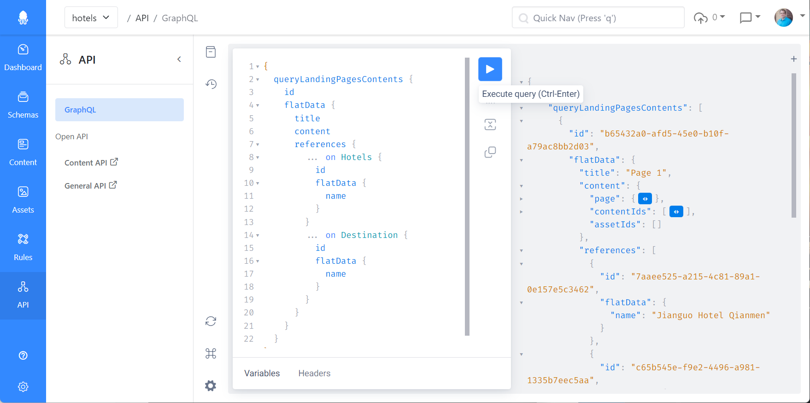

# React/Javascript Comppose Sample

You can create an app with prepulated schemas directly in Squidex.

## How to run it with a custom app?

Have a look to the configuration first: [configuration](src/utils/api-context.js)

You have to change the following settings:

* `appName`: The name of your app.
* `clientId`: The client id, usually: '`appName`:default'
* `clientSecret`: The secret for your client. You can get it from the Squidex UI.

Optionally:

* `appUrl`: The url to your squidex instance, e.g. `http://localhost:5000` if you run it locally.

## How does it work?

### Editor

The main purpose is to connect [React-Page](https://react-page.github.io/) with the [Squidex editor](https://docs.squidex.io/02-documentation/developer-guides/editors) plugin. Therefore we create on [custom cell plugin](https://react-page.github.io/docs/#/custom-cell-plugins) for each schemas and one cell plugin to pick assets from squidex.

The editor is made available as a separate page under http://localhost:3000.


The schemas can be configured under [src/pages/editor/config.ts](src/pages/editor/config.ts).

```
export const contentTypes: ContentTypes = {
    'hotels': {
        renderer: ({ content }) => {
            return (
                <Hotel hotel={content} />
            )
        },
        name: 'Hotel'
    },
    'destination': {
        renderer: ({ content }) => {
            return (
                <Destination destination={content} />
            )
        },
        name: 'Destination'
    },
}
```

Each schema has a display name for the editor and a render function. The cell plugins store the ID of the selected content item, which can be selected within the editor:



To improve performance the editor plugin provides an object with the actual page content and the list of references to Squidex. With a custom script we move the references to its own fields:



Therefore we can fetch all references and the actual page content with a single GraphQL query:



## How to start it

This project was bootstrapped with [Create React App](https://github.com/facebook/create-react-app).

### Available Scripts

In the project directory, you can run:

#### `npm start`

Runs the app in the development mode.<br />
Open [http://localhost:3000](http://localhost:3000) to view it in the browser.

The page will reload if you make edits.<br />
You will also see any lint errors in the console.

#### `npm test`

Launches the test runner in the interactive watch mode.<br />
See the section about [running tests](https://facebook.github.io/create-react-app/docs/running-tests) for more information.

#### `npm run build`

Builds the app for production to the `build` folder.<br />
It correctly bundles React in production mode and optimizes the build for the best performance.

The build is minified and the filenames include the hashes.<br />
Your app is ready to be deployed!

See the section about [deployment](https://facebook.github.io/create-react-app/docs/deployment) for more information.

#### `npm run eject`

**Note: this is a one-way operation. Once you `eject`, you can’t go back!**

If you aren’t satisfied with the build tool and configuration choices, you can `eject` at any time. This command will remove the single build dependency from your project.

Instead, it will copy all the configuration files and the transitive dependencies (Webpack, Babel, ESLint, etc) right into your project so you have full control over them. All of the commands except `eject` will still work, but they will point to the copied scripts so you can tweak them. At this point you’re on your own.

You don’t have to ever use `eject`. The curated feature set is suitable for small and middle deployments, and you shouldn’t feel obligated to use this feature. However we understand that this tool wouldn’t be useful if you couldn’t customize it when you are ready for it.

### Learn More

You can learn more in the [Create React App documentation](https://facebook.github.io/create-react-app/docs/getting-started).

To learn React, check out the [React documentation](https://reactjs.org/).

#### Code Splitting

This section has moved here: https://facebook.github.io/create-react-app/docs/code-splitting

#### Analyzing the Bundle Size

This section has moved here: https://facebook.github.io/create-react-app/docs/analyzing-the-bundle-size

#### Making a Progressive Web App

This section has moved here: https://facebook.github.io/create-react-app/docs/making-a-progressive-web-app

#### Advanced Configuration

This section has moved here: https://facebook.github.io/create-react-app/docs/advanced-configuration

#### Deployment

This section has moved here: https://facebook.github.io/create-react-app/docs/deployment

#### `npm run build` fails to minify

This section has moved here: https://facebook.github.io/create-react-app/docs/troubleshooting#npm-run-build-fails-to-minify
